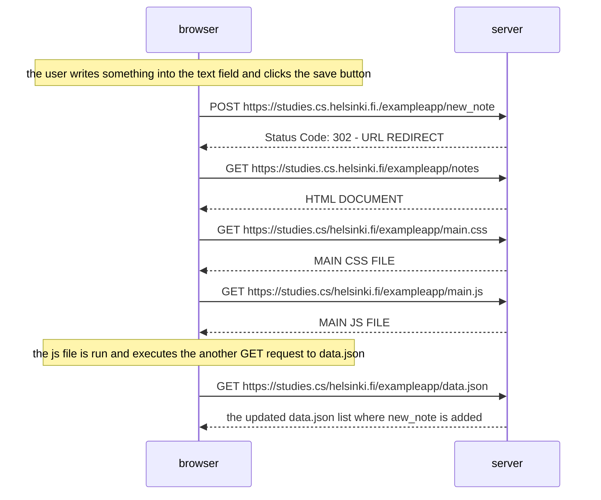

```mermaid
sequenceDiagram
    participant browser
    participant server

    Note over browser: the user writes something into the text field and clicks the save button
    browser->>server:  POST https://studies.cs.helsinki.fi./exampleapp/new_note
    server-->>browser: Status Code: 302 - URL REDIRECT
    
    browser->>server:  GET https://studies.cs.helsinki.fi/exampleapp/notes
    server-->>browser:  HTML DOCUMENT

    browser->>server:  GET https://studies.cs/helsinki.fi/exampleapp/main.css
    server-->>browser:  MAIN CSS FILE

    browser->>server:  GET https://studies.cs/helsinki.fi/exampleapp/main.js
    server-->>browser:  MAIN JS FILE
    Note over browser: the js file is run and executes the another GET request to data.json

    browser->>server:  GET https://studies.cs/helsinki.fi/exampleapp/data.json
    server-->>browser:  the updated data.json list where new_note is added
```
