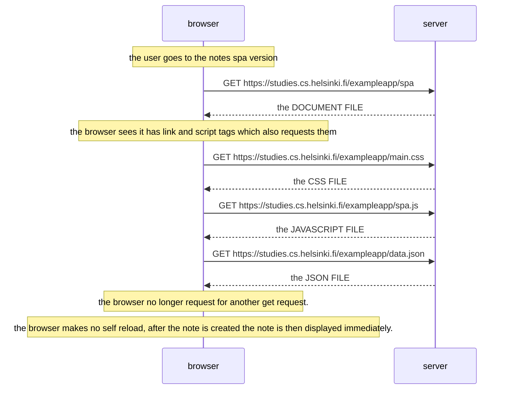

```mermaid
sequenceDiagram
    participant browser
    participant server

    Note over browser: the user goes to the notes spa version
    browser->>server: GET https://studies.cs.helsinki.fi/exampleapp/spa
    server-->>browser: the DOCUMENT FILE
    Note over browser: the browser sees it has link and script tags which also requests them

    browser->>server: GET https://studies.cs.helsinki.fi/exampleapp/main.css
    server-->>browser: the CSS FILE

    browser->>server: GET https://studies.cs.helsinki.fi/exampleapp/spa.js  
    server-->>browser: the JAVASCRIPT FILE

    browser->>server: GET https://studies.cs.helsinki.fi/exampleapp/data.json
    server-->>browser: the JSON FILE


    Note over browser: the browser no longer request for another get request.
    Note over browser: the browser makes no self reload, after the note is created the note is then displayed immediately.
    %% preventDefault() prevents the default handling of form's submit.
```
