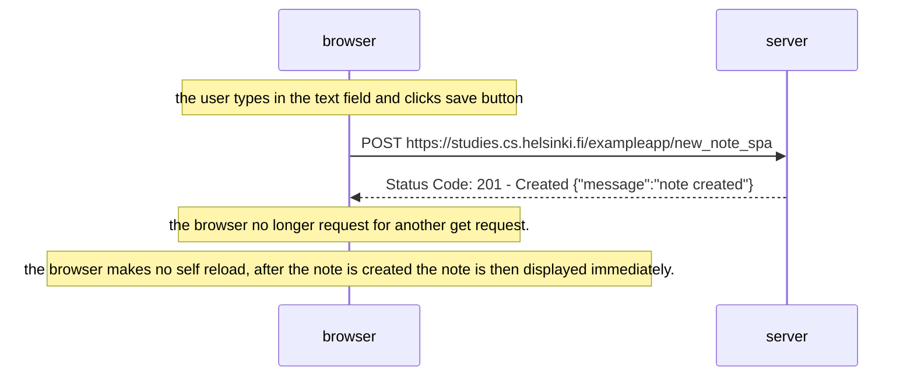

```mermaid
sequenceDiagram
    participant browser
    participant server

    Note over browser: the user types in the text field and clicks save button
    browser->>server: POST https://studies.cs.helsinki.fi/exampleapp/new_note_spa
    server-->>browser: Status Code: 201 - Created {"message":"note created"}
    Note over browser: the browser no longer request for another get request.
    Note over browser: the browser makes no self reload, after the note is created the note is then displayed immediately.
    %% preventDefault() prevents the default handling of form's submit.
```
